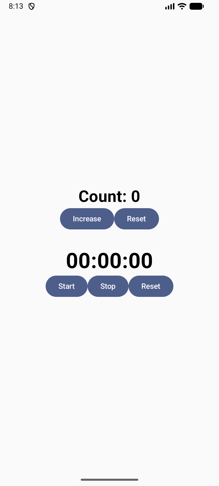
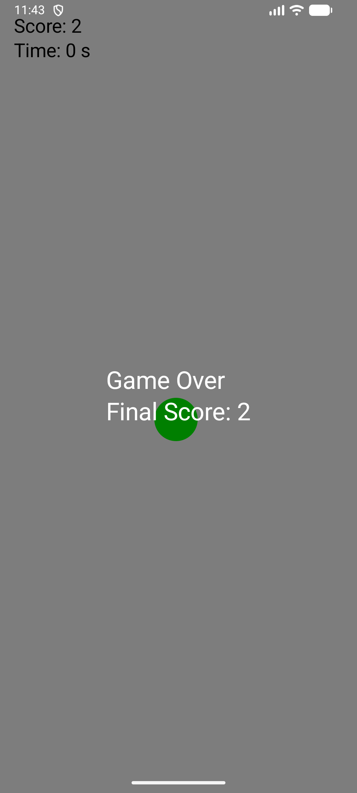

<h2 align="center">🌟 앱 미리보기</h2>

  <figure style="margin:10px;">
    
    <figcaption style="font-size:13px; color:gray;">📞 전화번호부 앱 – 연락처 관리</figcaption>
  </figure>

  <figure style="margin:10px;">
    
    <figcaption style="font-size:13px; color:gray;">⏱️ 스톱워치 앱 – 시간 측정 기능</figcaption>
  </figure>

  <figure style="margin:10px;">
    
    <figcaption style="font-size:13px; color:gray;">☕ 커피 타이머 – 완벽한 브루잉 타임</figcaption>
  </figure>

  <figure style="margin:10px;">
    
    <figcaption style="font-size:13px; color:gray;">🎮 버블 게임 – 터치로 점수 쌓기</figcaption>
  </figure>

  <figure style="margin:10px;">
    
    <figcaption style="font-size:13px; color:gray;">🕹️ 버튼 게임 – 10초 안에 몇 번 클릭?</figcaption>
  </figure>

