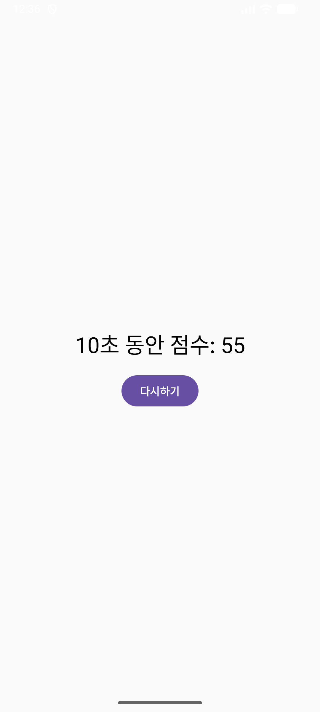

<h2 align="center">🌟 앱 미리보기</h2>

<table align="center">
  <tr>
    <td align="center">
       
      📞 전화번호부 앱
    </td>
    <td align="center">
       
      ⏱️ 스톱워치 앱
    </td>
    <td align="center">
       
      ☕ 커피 가격
    </td>
    <td align="center">
       
      🎮 버블 게임
    </td>
    <td align="center">
       
      🕹️ 버튼 게임
    </td>
  </tr>

🐦 참새 사냥 게임

🎯 개요

장르: 클릭형 캐주얼 슈팅

플랫폼: Android 8.0 이상

세션 길이: 스테이지당 30초, 총 4스테이지
🕹 플레이 방식

화면을 탭해 새를 맞혀 점수 획득

제한 시간 내 목표 점수를 기록
🐦 등장 개체

개체	점수	특징

참새	+5	기본 타깃

까치	−1	조금 더 큰 크기

멧새	−3	빠른 이동, 비슷한 생김새, 실질적 방해물
🎯 점수 규칙

참새 +5, 까치 −2, 멧새 −4

  <tr>
    <td align="center">
       
      ✨ 게임 실행 중
    </td>
    <td align="center">
       
      ✨ 게임 오버
    </td>
    <td align="center">
       
      ✨ 클리어
    </td>
    <td></td>
    <td></td>
  </tr>
</table>
